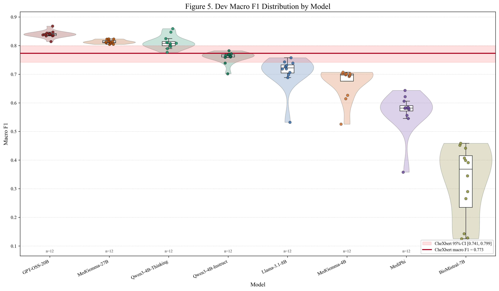
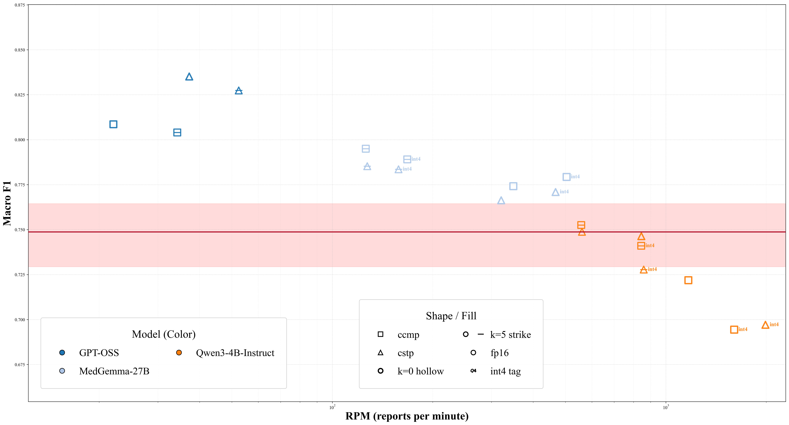
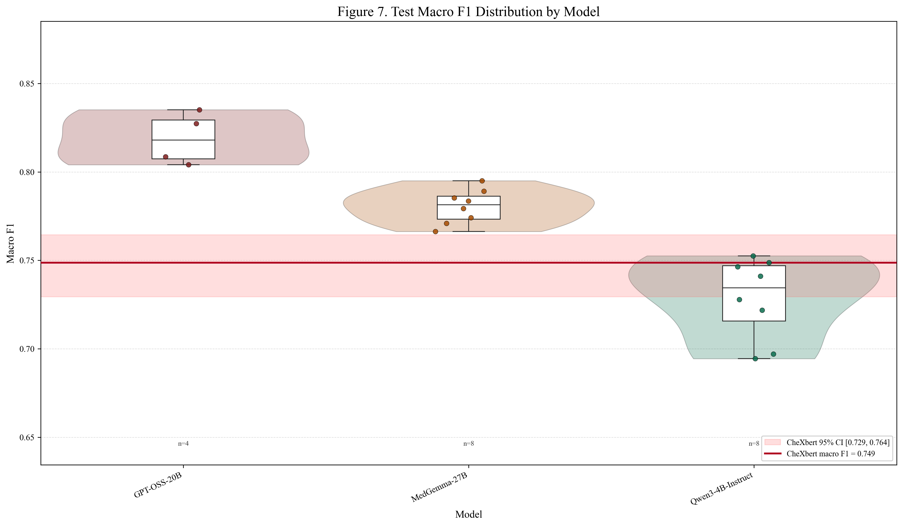

# CXR Labeller

<p align="center">
  
  
  
  
</p>

## Abstract

This pipeline turns free-text chest X-ray reports into the standard 14 CXR finding labels used in clinical benchmarking. With strong prompting, MedGamma 27B and OSS-20B achieve higher F1 on both dev and test than CheXbert, and quantized MedGemma 27B delivers major speedups while keeping performance practical. The workflow lets you compare different open LLMs, prompt styles, quantization levels, and few-shot setups in one consistent system so you can select the right quality-speed-efficiency tradeoff for deployment.

Text-only chest X-ray (CXR) report labeling pipeline for CheXpert-style 14-label prediction, with zero-shot and retrieval-based few-shot inference using open-weight LLMs.

## What this repo does

- Loads harmonized CXR report datasets (`dev`, `test`, and per-dataset splits).
- Builds MedCPT retrieval archives for few-shot example selection.
- Runs batched vLLM inference across model, prompt, quantization, and k-shot settings.
- Saves prediction JSONL files, logs, and scoring artifacts for publication reporting.

## Repository layout

- `src/core/`: inference engine, model registry, prompts, retrieval, data loading.
- `src/cli/ppe_retrieval.py`: main CLI entrypoint for inference runs.
- `configs/run_defaults.yaml`: default run configuration.
- `models.jsonl`: model catalog and default batch sizes per quant mode and k-shot.
- `results/`: predictions, logs, and derived outputs.

## Quick start

### 1) Environment setup

```bash
python -m venv .venv
# Linux/macOS
source .venv/bin/activate
# Windows PowerShell
# .\.venv\Scripts\Activate.ps1

pip install --upgrade pip
pip install -r requirements.txt
```

### 2) Run a smoke-test inference

```bash
python -m src.cli.ppe_retrieval \
  --dataset all \
  --split dev \
  --quant-mode fp16 \
  --model openai/gpt-oss-20b \
  --k-shot 0 \
  --prompt-variants clinical_compact \
  --limit 20
```

## Full pipeline


### 1) Generate MedCPT embeddings

```bash
python src/generate_medcpt_article_embeddings.py --input data/few_shot/few_shot_50.csv --output data/embeddings/few_shot_50_medcpt_article.jsonl --revision <HF_COMMIT> --normalize
python src/generate_medcpt_article_embeddings.py --input data/dev/dev_all.csv --output data/embeddings/dev_all_medcpt_article.jsonl --revision <HF_COMMIT> --normalize
python src/generate_medcpt_article_embeddings.py --input data/test/test_all.csv --output data/embeddings/test_all_medcpt_article.jsonl --revision <HF_COMMIT> --normalize
```

### 2) Build retrieval archives

```bash
python src/build_medcpt_fewshot_retrieval_archives.py --top-k 10
```

### 3) Run inference

Example: all models for dev split, fp16, k=5, one prompt variant.

```bash
python -m src.cli.ppe_retrieval \
  --dataset all \
  --split dev \
  --quant-mode fp16 \
  --all-models \
  --k-shot 5 \
  --prompt-variants clinical_stepwise
```

You can also run test split and INT4:

```bash
python -m src.cli.ppe_retrieval --dataset all --split test --quant-mode int4 --model Qwen/Qwen3-4B-Instruct-2507 --k-shot 5 --prompt-variants clinical_compact
```


## Outputs

- Predictions: `results/preds/<dataset_split>/*.jsonl`
- Logs: `results/logs/*.log`

## Results

<p align="center">
  
</p>

<p align="center">
  
</p>
<p align="center"><em>n=1250</em></p>

<p align="center">
  
</p>

### Table

| Label | F1 | F1 - CheXbert F1 |
| --- | ---: | ---: |
| No Finding | 0.860 | +0.275 |
| Enl. Cardiomediastinum | 0.419 | -0.011 |
| Cardiomegaly | 0.851 | +0.029 |
| Lung Opacity | 0.814 | +0.055 |
| Lung Lesion | 0.805 | +0.112 |
| Edema | 0.916 | +0.035 |
| Consolidation | 0.906 | +0.114 |
| Pneumonia | 0.924 | +0.120 |
| Atelectasis | 0.935 | +0.030 |
| Pneumothorax | 0.950 | +0.115 |
| Pleural Effusion | 0.933 | +0.015 |
| Pleural Other | 0.719 | +0.119 |
| Fracture | 0.779 | +0.118 |
| Support Devices | 0.882 | +0.086 |

---

## Acknowledgement

<p>
  Powered by infrastructure support from <strong>SimplePod.ai</strong>, an HPC GPU hosting company located in Europe (Poland).
</p>

<p>
  Contact: <a href="mailto:help@simplepod.ai">help@simplepod.ai</a>
</p>

<p>
  
</p>
